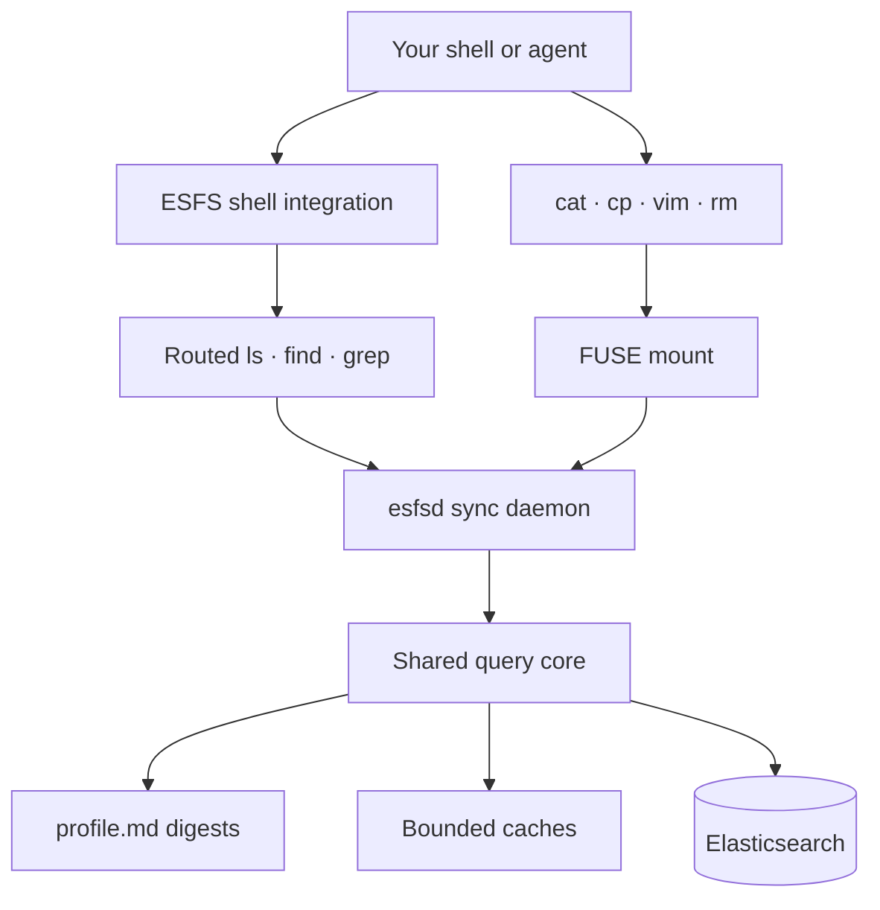

# ESFS — Elasticsearch as a filesystem

[](https://github.com/dbmurphy/elasticsearch-filesystem/actions/workflows/ci.yml)
[](https://github.com/dbmurphy/elasticsearch-filesystem/releases)
[](https://goreportcard.com/report/github.com/dbmurphy/elasticsearch-filesystem)
[](LICENSE)

> **Mount Elasticsearch and use it like a local drive.** Browse indices as directories, read and write documents as files, and let `grep` become a ranked Elasticsearch search — all without changing a single mapping.

```sh
# Your Elasticsearch cluster, mounted:
esfs mount --mount /esfs

cd /esfs/conversations
cat r1                           # read a document as JSON
echo '{"msg":"updated"}' > r1   # write it back to Elasticsearch
grep "red shoes" --since 7d .   # ranked semantic search, time-filtered
ls                               # list every document in the index
find /esfs                       # walk all visible indices
```

---

## Why ESFS?

| Without ESFS | With ESFS |
|---|---|
| Write custom ES query code to read a doc | `cat /esfs/conversations/<id>` |
| Build a script to bulk-edit documents | Open in any editor, save, synced |
| Remember `_search` DSL to find something | `grep "refund" /esfs/conversations` |
| No time-based filtering without extra code | `grep "red shoes" --since 7d .` |
| Different tool for every agent workflow | Standard shell tools work everywhere |

No Elasticsearch-side setup required — no mapping changes, no ingest pipelines, no helper indices.

---

## Quick start

**1. Install a FUSE backend** (once):

| Platform | Command |
|----------|---------|
| Linux | `sudo apt-get install fuse3` |
| macOS (kextless) | Install [FUSE-T](https://www.fuse-t.org/) |
| macOS (full) | Install [macFUSE](https://macfuse.io) |

**2. Install ESFS:**

```sh
# macOS — Homebrew tap
brew install --cask dbmurphy/tap/esfs

# Linux + macOS — Go toolchain
go install github.com/dbmurphy/elasticsearch-filesystem/cmd/esfs@latest
go install github.com/dbmurphy/elasticsearch-filesystem/cmd/esfsd@latest
go install github.com/dbmurphy/elasticsearch-filesystem/cmd/esfs-{grep,ls,find}@latest

# Or download a prebuilt tarball from the Releases page
```

**3. Mount and explore:**

```sh
export ESFS_ENDPOINT=https://localhost:9200
export ES_API_KEY=your_key_here

esfs mount --mount /esfs          # mounts all visible indices
esfs doctor                        # verify everything is working

eval "$(esfs env)"                 # activate routed ls/find/grep
cd /esfs/conversations
ls                                 # stream document names from ES
grep refund                        # ranked Elasticsearch search
grep "red shoes" --since 7d        # time-filtered ranked search
cat <id>                           # read a document
echo '{"updated":true}' > <id>    # write it back to ES
```

Full installation guide: [docs/INSTALL.md](docs/INSTALL.md)

---

## How it works



ESFS has two surfaces — they work independently, not as a single magic shim:

| Surface | How it works | Applies to |
|---------|-------------|-----------|
| **FUSE mount** | Every file syscall goes directly to Elasticsearch | `cat`, `>`, `cp`, `vim`, `rm`, any editor |
| **Routed commands** | Translates shell discovery/search intent into ES queries | `ls`, `find`, `grep` when `esfs env` is active |

Standard tools like `cat`/`cp`/editors go through the mount — they are **never** shimmed.

---

## One mount, all your indices

A single mount exposes **every visible index** as a directory. No need to mount one index at a time:

```
/esfs/
├── conversations/      ← one dir per index/alias
│   ├── r1              ← document ID as filename
│   ├── r2
│   └── profile.md      ← auto-generated index digest
├── orders/
├── logs-2026.06/
└── profile.md          ← cluster-scope digest
```

```sh
esfs mount --mount /esfs                        # all visible indices
esfs mount --mount /esfs --index orders,logs    # allowlist
```

---

## Search semantics

`grep` inside ESFS is a real Elasticsearch query, not a file scan:

| Mode | When | How to force |
|------|------|-------------|
| **Semantic** | Index has `semantic_text` fields | `--mode semantic` |
| **Ranked lexical** | Default when no semantic fields | `--mode lexical` |
| **Exact** | Unsupported flag or `--exact` | `ESFS_GREP_MODE=exact` |

- `grep "red shoes" --since 7d` → time-filtered ranked search using the index's configured date field
- `grep refund -l` → paths only (one per matching document)
- `/usr/bin/grep` is never hijacked — always available for exact byte-level matching

Exit codes match `grep`: `0` match · `1` no match · `2` error.

---

## Per-index configuration

Each index can search differently from a single config file:

```json
{
  "endpoint": "https://localhost:9200",
  "indices": {
    "conversations": {
      "time_field": "@timestamp",
      "search_fields": ["subject", "body"],
      "semantic_fields": ["body_semantic"]
    },
    "logs-app": { "grep_mode": "lexical", "profile": false }
  }
}
```

Each index's effective search mode is shown at the top of its `profile.md`. Full reference: [docs/CONFIGURATION.md](docs/CONFIGURATION.md)

---

## Safety guarantees

- Writes use whole-document replacement with **optimistic concurrency** — version conflicts surface as errors, never silent overwrites.
- Invalid JSON is **never flushed** to Elasticsearch; it stays in the staging buffer.
- Delete is **disabled by default** — enable per-mount with `--delete-sync`.
- **Zero Elasticsearch-side setup**: no mapping changes, templates, ingest pipelines, scripts, helper indices, or stored digests. All profile data is local-only.

---

## Develop & test

```sh
make test        # unit + integration tests (no cluster or mount needed)
make vet
make bench       # ESFS overhead benchmarks
make acceptance  # Docker: Linux + real Elasticsearch end-to-end acceptance
```

`make acceptance` runs the full parity loop (mount, `cat`, write-back, `ls`, `find`, `grep`, `--since`, exact `/usr/bin/grep`, `profile.md`, and the no-ES-setup guard) against a real Elasticsearch node inside Docker. See [docs/ACCEPTANCE.md](docs/ACCEPTANCE.md).

---

## Releases & contributing

Commits follow [Conventional Commits](https://www.conventionalcommits.org/). On merge to `main`, release-please opens a version-bump PR; merging it triggers GoReleaser which publishes cross-platform binaries and the Homebrew tap automatically.

| Commit type | Version bump |
|------------|-------------|
| `fix:` | patch |
| `feat:` | minor |
| `feat!:` / `BREAKING CHANGE:` | major |

---

## Documentation

| Doc | Contents |
|-----|---------|
| [docs/INSTALL.md](docs/INSTALL.md) | FUSE backend, install options, services, uninstall |
| [docs/CONFIGURATION.md](docs/CONFIGURATION.md) | Full config reference — global and per-index |
| [docs/CONTRACTS.md](docs/CONTRACTS.md) | Path model, encoding, error mapping |
| [docs/ACCEPTANCE.md](docs/ACCEPTANCE.md) | Docker acceptance harness |
| [docs/BENCHMARKS.md](docs/BENCHMARKS.md) | Performance gates and methodology |
| [examples/](examples/) | Rendered `profile.md` and full config examples |
